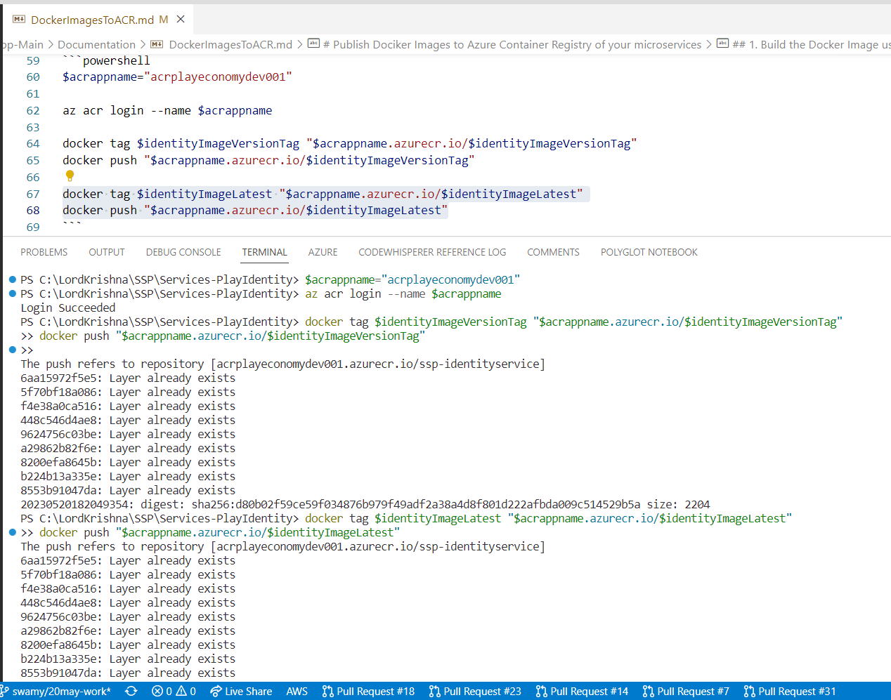
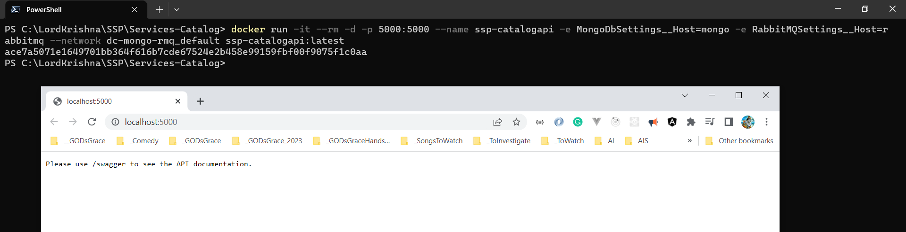

# Publish Dociker Images to Azure Container Registry of your microservices

## 1. Build the Docker Image using Docker CLI and PowerShell

### 1.1. Export required Variables using PowerShell Windows Terminal

```powershell
$env:GH_OWNER="Microservices-for-Small-App"
$env:GH_PAT="ghp_Your_GitHib_Classic_PAT"
```

### 1.2. Execute the below mentioned Docker Command(s) in PowerShell Windows Terminal to **CREATE** the Docker Image

```powershell
cd C:\LordKrishna\SSP\Services-PlayIdentity

$identityImageVersionTag="ssp-identityservice:$(Get-Date -Format yyyyMMddHHmmssfff)"
$identityImageLatest="ssp-identityservice:latest"

docker build --secret id=GH_OWNER --secret id=GH_PAT --pull --rm -f "./Src/Identity.Service/Prod.Dockerfile" -t $identityImageVersionTag -t $identityImageLatest .
```


### 1.3. Execute the below mentioned Docker Command(s) in PowerShell Windows Terminal to **RUN** Docker Container

#### 1.3.1. With Local MongoDB and RabbitMQ

```powershell
$adminPass="Sample@123$"

docker run -it --rm -d -p 5002:5002 --name ssp-identity -e MongoDbSettings__Host=mongo -e RabbitMQSettings__Host=rabbitmq -e IdentitySettings__AdminUserPassword=$adminPass --network dc-mongo-rmq_default $identityImageLatest
```

#### 1.3.2. With Azure CosmosDB and Local RabbitMQ

```powershell
$adminPass="Sample@123$"
$cosmosDbConnString="[Azure Cosmos DB CONN STRING HERE]"

docker run -it --rm -d -p 5002:5002 --name ssp-identity -e MongoDbSettings__ConnectionString=$cosmosDbConnString -e RabbitMQSettings__Host=rabbitmq -e IdentitySettings__AdminUserPassword=$adminPass --network dc-mongo-rmq_default $identityImageLatest
```

#### 1.3.3. With Azure CosmosDB and Azure Service Bus

```powershell
$adminPass="Sample@123$"
$cosmosDbConnString="[Azure Cosmos DB CONN STRING HERE]"
$serviceBusConnString="[CONN STRING HERE]"
$messageBroker="SERVICEBUS" # SERVICEBUS or RABBITMQ

docker run -it --rm -d -p 5002:5002 --name ssp-identity -e MongoDbSettings__ConnectionString=$cosmosDbConnString -e ServiceBusSettings__ConnectionString=$serviceBusConnString -e ServiceSettings__MessageBroker=$messageBroker -e IdentitySettings__AdminUserPassword=$adminPass --network dc-mongo-rmq_default $identityImageLatest
```


### 1.4. Publishing the Identity Docker image to ACR

```powershell
$acrappname="acrplayeconomydev001"
az acr login --name $acrappname

$identityAcrVersionTag = "$acrappname.azurecr.io/$identityImageVersionTag"
docker tag $identityImageVersionTag $identityAcrVersionTag
docker push $identityAcrVersionTag

$identityAcrLatest = "$acrappname.azurecr.io/$identityImageLatest"
docker tag $identityImageLatest $identityAcrLatest
docker push $identityAcrLatest
```




## 2. Catalog.API

### 2.1. Execute the below mentioned Docker Command(s) in PowerShell Windows Terminal to **CREATE** the Docker Image

```powershell
cd C:\LordKrishna\SSP\Services-Catalog

$catalogapiImageVersionTag="ssp-catalogapi:$(Get-Date -Format yyyyMMddHHmmssfff)"
$catalogapiImageLatest="ssp-catalogapi:latest"

docker build --secret id=GH_OWNER --secret id=GH_PAT --pull --rm -f "./src/Catalog.API/Prod.Dockerfile" -t $catalogapiImageVersionTag -t $catalogapiImageLatest .
```


### 2.2. Execute the below mentioned Docker Command(s) in PowerShell Windows Terminal to **RUN** Docker Container

#### 2.2.1. With Local MongoDB and RabbitMQ

```powershell
docker run -it --rm -d -p 5000:5000 --name ssp-catalogapi -e MongoDbSettings__Host=mongo -e RabbitMQSettings__Host=rabbitmq --network dc-mongo-rmq_default $catalogapiImageLatest
```

#### 2.2.2. With Azure CosmosDB and Local RabbitMQ

```powershell
$cosmosDbConnString="[Azure Cosmos DB CONN STRING HERE]"

docker run -it --rm -d -p 5000:5000 --name ssp-catalogapi -e MongoDbSettings__ConnectionString=$cosmosDbConnString -e RabbitMQSettings__Host=rabbitmq --network dc-mongo-rmq_default $catalogapiImageLatest
```

#### 2.2.3. With Azure CosmosDB and Azure Service Bus

```powershell
$cosmosDbConnString="[Azure Cosmos DB CONN STRING HERE]"
$serviceBusConnString="[CONN STRING HERE]"
$messageBroker="SERVICEBUS" # SERVICEBUS or RABBITMQ

docker run -it --rm -d -p 5000:5000 --name ssp-catalogapi -e MongoDbSettings__ConnectionString=$cosmosDbConnString -e ServiceBusSettings__ConnectionString=$serviceBusConnString -e ServiceSettings__MessageBroker=$messageBroker --network dc-mongo-rmq_default $catalogapiImageLatest
```



### 2.4. Publishing the Catalog API Docker image to ACR

```powershell
$acrappname="acrplayeconomydev001"
az acr login --name $acrappname

$catalogapiAcrVersionTag = "$acrappname.azurecr.io/$catalogapiImageVersionTag"
docker tag $catalogapiImageVersionTag $catalogapiAcrVersionTag
docker push $catalogapiAcrVersionTag

$catalogapiAcrLatest = "$acrappname.azurecr.io/$catalogapiImageLatest"
docker tag $catalogapiImageLatest $catalogapiAcrLatest
docker push $catalogapiAcrLatest
```


## 3. Inventory.API

### 3.1. Execute the below mentioned Docker Command(s) in PowerShell Windows Terminal to **CREATE** the Docker Image

```powershell
cd C:\LordKrishna\SSP\Services-Inventory

docker build --secret id=GH_OWNER --secret id=GH_PAT --pull --rm -f "./src/Inventory.API/Prod.Dockerfile" -t ssp-inventoryapi:$(Get-Date -Format yyyyMMddHHmmssfff) -t ssp-inventoryapi:latest .
```


### 3.2. Execute the below mentioned Docker Command(s) in PowerShell Windows Terminal to **RUN** Docker Container

#### 3.2.1. With Local MongoDB and RabbitMQ

```powershell
docker run -it --rm -d -p 5004:5004 --name ssp-inventoryapi -e MongoDbSettings__Host=mongo -e RabbitMQSettings__Host=rabbitmq --network dc-mongo-rmq_default ssp-inventoryapi:latest
```

#### 3.2.2. With Azure CosmosDB and Local RabbitMQ

```powershell
$cosmosDbConnString="[Azure Cosmos DB CONN STRING HERE]"

docker run -it --rm -d -p 5004:5004 --name ssp-inventoryapi -e MongoDbSettings__ConnectionString=$cosmosDbConnString -e RabbitMQSettings__Host=rabbitmq --network dc-mongo-rmq_default ssp-inventoryapi:latest
```

#### 3.2.3. With Azure CosmosDB and Azure Service Bus

```powershell
$cosmosDbConnString="[Azure Cosmos DB CONN STRING HERE]"
$serviceBusConnString="[CONN STRING HERE]"
$messageBroker="SERVICEBUS" # SERVICEBUS or RABBITMQ

docker run -it --rm -d -p 5004:5004 --name ssp-inventoryapi -e MongoDbSettings__ConnectionString=$cosmosDbConnString -e ServiceBusSettings__ConnectionString=$serviceBusConnString -e ServiceSettings__MessageBroker=$messageBroker --network dc-mongo-rmq_default ssp-inventoryapi:latest
```


## 4. Trading.API

### 4.1. Execute the below mentioned Docker Command(s) in PowerShell Windows Terminal to **CREATE** the Docker Image

```powershell
cd C:\LordKrishna\SSP\Services-Trading

docker build --secret id=GH_OWNER --secret id=GH_PAT --pull --rm -f "./src/Trading.API/Prod.Dockerfile" -t ssp-tradingapi:$(Get-Date -Format yyyyMMddHHmmssfff) -t ssp-tradingapi:latest .
```


### 4.2. Execute the below mentioned Docker Command(s) in PowerShell Windows Terminal to **RUN** Docker Container

#### 4.2.1. With Local MongoDB and RabbitMQ

```powershell
docker run -it --rm -d -p 5006:5006 --name ssp-tradingapi -e MongoDbSettings__Host=mongo -e RabbitMQSettings__Host=rabbitmq --network dc-mongo-rmq_default ssp-tradingapi:latest
```

#### 4.2.2. With Azure CosmosDB and Local RabbitMQ

```powershell
$cosmosDbConnString="[Azure Cosmos DB CONN STRING HERE]"

docker run -it --rm -d -p 5006:5006 --name ssp-tradingapi -e MongoDbSettings__ConnectionString=$cosmosDbConnString -e RabbitMQSettings__Host=rabbitmq --network dc-mongo-rmq_default ssp-tradingapi:latest
```

#### 4.2.3. With Azure CosmosDB and Azure Service Bus

```powershell
$cosmosDbConnString="[Azure Cosmos DB CONN STRING HERE]"
$serviceBusConnString="[CONN STRING HERE]"
$messageBroker="SERVICEBUS" # SERVICEBUS or RABBITMQ

docker run -it --rm -d -p 5006:5006 --name ssp-tradingapi -e MongoDbSettings__ConnectionString=$cosmosDbConnString -e ServiceBusSettings__ConnectionString=$serviceBusConnString -e ServiceSettings__MessageBroker=$messageBroker --network dc-mongo-rmq_default ssp-tradingapi:latest
```


