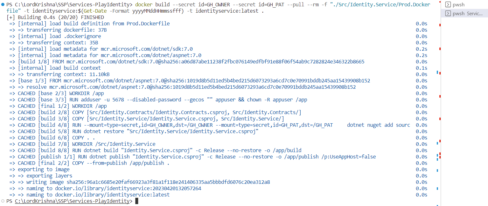

# Docikerize your microservices

```powershell
$env:GH_OWNER="Microservices-for-Small-App"
$env:GH_PAT="ghp_Your_GitHib_Classic_PAT"
```

```powershell
docker build --secret id=GH_OWNER --secret id=GH_PAT --pull --rm -f "./Src/Identity.Service/Prod.Dockerfile" -t identityservice:$(Get-Date -Format yyyyMMddHHmmssfff) -t identityservice:latest .
```



```powershell
$adminPass="[PASSWORD HERE-Sample@123$]"
docker run -it --rm -d -p 5002:5002 --name identity -e MongoDbSettings__Host=mongo -e RabbitMQSettings__Host=rabbitmq -e IdentitySettings__AdminUserPassword=$adminPass --network dakar_default identityservice:latest
```
