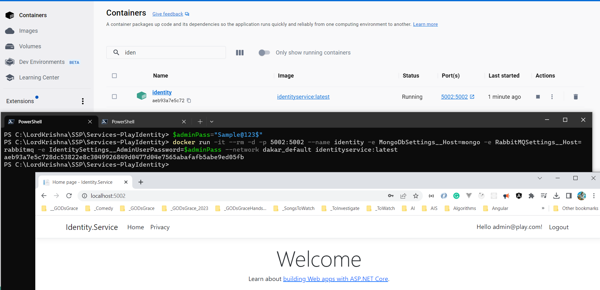

# Docikerize your microservices

## 1. Build the Docker Image using Docker CLI and PowerShell

### 1.1. Export required Variables using PowerShell Windows Terminal

```powershell
$env:GH_OWNER="Microservices-for-Small-App"
$env:GH_PAT="ghp_Your_GitHib_Classic_PAT"
```

### 1.2. Execute the below mentioned Docker Command(s) in PowerShell Windows Terminal to **CREATE** the Docker Image

```powershell
cd C:\LordKrishna\SSP\Services-PlayIdentity

docker build --secret id=GH_OWNER --secret id=GH_PAT --pull --rm -f "./Src/Identity.Service/Prod.Dockerfile" -t ssp-identityservice:$(Get-Date -Format yyyyMMddHHmmssfff) -t ssp-identityservice:latest .
```


### 1.3. Execute the below mentioned Docker Command(s) in PowerShell Windows Terminal to **RUN** Docker Container

#### 1.3.1. With Local MongoDB and RabbitMQ

```powershell
$adminPass="Sample@123$"
docker run -it --rm -d -p 5002:5002 --name ssp-identity -e MongoDbSettings__Host=mongo -e RabbitMQSettings__Host=rabbitmq -e IdentitySettings__AdminUserPassword=$adminPass --network dakar_default ssp-identityservice:latest
```

#### 1.3.2. With Azure CosmosDB and Local RabbitMQ

```powershell
$adminPass="Sample@123$"
$cosmosDbConnString="[Azure Cosmos DB CONN STRING HERE]"
docker run -it --rm -d -p 5002:5002 --name ssp-identity -e MongoDbSettings__ConnectionString=$cosmosDbConnString -e RabbitMQSettings__Host=rabbitmq -e IdentitySettings__AdminUserPassword=$adminPass --network dakar_default ssp-identityservice:latest
```

#### 1.3.3. With Azure CosmosDB and Azure Service Bus

```powershell
$adminPass="Sample@123$"
$cosmosDbConnString="[Azure Cosmos DB CONN STRING HERE]"
$serviceBusConnString="[CONN STRING HERE]"
docker run -it --rm -d -p 5002:5002 --name ssp-identity -e MongoDbSettings__ConnectionString=$cosmosDbConnString -e ServiceBusSettings__ConnectionString=$serviceBusConnString -e ServiceSettings__MessageBroker="SERVICEBUS" -e IdentitySettings__AdminUserPassword=$adminPass --network dakar_default ssp-identityservice:latest
```



## 2. Catalog.API

### 2.1. Execute the below mentioned Docker Command(s) in PowerShell Windows Terminal to **CREATE** the Docker Image

```powershell
cd C:\LordKrishna\SSP\Services-Catalog

docker build --secret id=GH_OWNER --secret id=GH_PAT --pull --rm -f "./src/Catalog.API/Prod.Dockerfile" -t ssp-catalogapi:$(Get-Date -Format yyyyMMddHHmmssfff) -t ssp-catalogapi:latest .

docker run -it --rm -d -p 5000:5000 --name ssp-catalogapi -e MongoDbSettings__Host=mongo -e RabbitMQSettings__Host=rabbitmq --network dakar_default ssp-catalogapi:latest
```

### 2.2. Execute the below mentioned Docker Command(s) in PowerShell Windows Terminal to **RUN** Docker Container

#### 2.2.1. With Local MongoDB and RabbitMQ

```powershell
$adminPass="Sample@123$"
docker run -it --rm -d -p 5002:5002 --name ssp-identity -e MongoDbSettings__Host=mongo -e RabbitMQSettings__Host=rabbitmq -e IdentitySettings__AdminUserPassword=$adminPass --network dakar_default ssp-identityservice:latest
```

#### 2.2.2. With Azure CosmosDB and Local RabbitMQ

```powershell
$adminPass="Sample@123$"
$cosmosDbConnString="[Azure Cosmos DB CONN STRING HERE]"
docker run -it --rm -d -p 5002:5002 --name ssp-identity -e MongoDbSettings__ConnectionString=$cosmosDbConnString -e RabbitMQSettings__Host=rabbitmq -e IdentitySettings__AdminUserPassword=$adminPass --network dakar_default ssp-identityservice:latest
```

#### 2.2.3. With Azure CosmosDB and Azure Service Bus

```powershell
$adminPass="Sample@123$"
$cosmosDbConnString="[Azure Cosmos DB CONN STRING HERE]"
$serviceBusConnString="[CONN STRING HERE]"
docker run -it --rm -d -p 5002:5002 --name ssp-identity -e MongoDbSettings__ConnectionString=$cosmosDbConnString -e ServiceBusSettings__ConnectionString=$serviceBusConnString -e ServiceSettings__MessageBroker="SERVICEBUS" -e IdentitySettings__AdminUserPassword=$adminPass --network dakar_default ssp-identityservice:latest
```

## 3. Inventory.API

```powershell
cd C:\LordKrishna\SSP\Services-Inventory

docker build --secret id=GH_OWNER --secret id=GH_PAT --pull --rm -f "./src/Inventory.API/Prod.Dockerfile" -t ssp-inventoryapi:$(Get-Date -Format yyyyMMddHHmmssfff) -t ssp-inventoryapi:latest .

docker run -it --rm -d -p 5004:5004 --name ssp-inventoryapi -e MongoDbSettings__Host=mongo -e RabbitMQSettings__Host=rabbitmq --network dakar_default ssp-inventoryapi:latest
```

## 4. Trading.API

```powershell
cd C:\LordKrishna\SSP\Services-Trading

docker build --secret id=GH_OWNER --secret id=GH_PAT --pull --rm -f "./src/Trading.API/Prod.Dockerfile" -t ssp-tradingapi:$(Get-Date -Format yyyyMMddHHmmssfff) -t ssp-tradingapi:latest .

docker run -it --rm -d -p 5006:5006 --name ssp-tradingapi -e MongoDbSettings__Host=mongo -e RabbitMQSettings__Host=rabbitmq --network dakar_default ssp-tradingapi:latest
```
