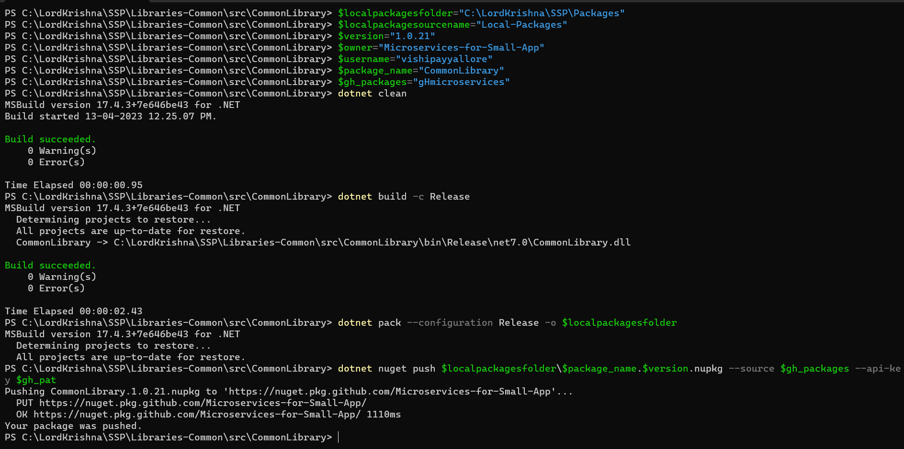

# Publishing .NET 7 NuGet Packages

## 1. Create and Publish NuGet packages to Local Folder using dotnet CLI and PowerShell

### 1.1. Create required Variables using PowerShell Windows Terminal

```powershell
$localpackagesfolder="C:\LordKrishna\SSP\Packages"
$localpackagesourcename="Local-Packages"
```

### 1.2. Publishing the packages to local folder using PowerShell Windows Terminal

> 1. Navigate to the folder where the `YourLibrary`.csproj file is present.
> 1. In this case, it is the `C:\LordKrishna\SSP\Libraries-Common\src\CommonLibrary` folder where the `YourLibrary`.csproj file is present.
> 1. Update the `Version`, and `AssemblyVersion` in the `YourLibrary`.csproj file.
> 1. Run the following `dotnet` commands.

```xml
<PropertyGroup>
    <Version>1.0.18</Version>
    <AssemblyVersion>1.18</AssemblyVersion>
</PropertyGroup>
```

```powershell
dotnet clean
dotnet build
dotnet pack -o $localpackagesfolder
```

## 2. Add the Local NuGet package folder as Package Source

### 2.1. Adding local packages folder as NuGet source using PowerShell Windows Terminal

> 1. Run the following `dotnet` commands.

```powershell
dotnet nuget add source $localpackagesfolder -n $localpackagesourcename
```

### 2.2. Verify local packages folder is added as NuGet source

> 1. Run the following `dotnet` commands, to ensure that `$localpackagesourcename` is added as NuGet package source.
> 1. Run the following `dotnet nuget remove source $localpackagesourcename` command, to remove NuGet package source.

```powershell
dotnet nuget list source
```


## 3. Create and Publish NuGet packages to GitHub Packages using dotnet CLI and PowerShell

### 3.1. Creating required Variables using PowerShell Windows Terminal

```powershell
$gh_pat="ghp_Your_GitHib_Classic_PAT"
$localpackagesfolder="C:\LordKrishna\SSP\Packages"
$owner="Microservices-for-Small-App"
$username="vishipayyallore"
$gh_packages="gHmicroservices"

cd C:\LordKrishna\SSP\Libraries-Common\src\CommonLibrary
# Update the version number and ensure it matches the version in the csproj file
$version="1.0.24"  
$package_name="CommonLibrary"
$host.ui.RawUI.WindowTitle=$package_name

cd C:\LordKrishna\SSP\Services-Catalog\src\Catalog.Contracts
# Update the version number and ensure it matches the version in the csproj file
$version="1.0.7"
$package_name="Catalog.Contracts"
$host.ui.RawUI.WindowTitle=$package_name

cd C:\LordKrishna\SSP\Services-Inventory\src\Inventory.Contracts
# Update the version number and ensure it matches the version in the csproj file
$version="1.0.9"
$package_name="Inventory.Contracts"
$host.ui.RawUI.WindowTitle=$package_name

cd C:\LordKrishna\SSP\Services-PlayIdentity\Src\Identity.Contracts
# Update the version number and ensure it matches the version in the csproj file
$version="1.0.9"
$package_name="Identity.Contracts"
$host.ui.RawUI.WindowTitle=$package_name
```

### 3.2. Publishing the packages to GitHub Packages using PowerShell Windows Terminal

```powershell
dotnet clean
dotnet build -c Release
dotnet pack --configuration Release -o $localpackagesfolder

dotnet nuget push $localpackagesfolder\$package_name.$version.nupkg --source $gh_packages --api-key $gh_pat
```




### 3.3. Adding GitHub Packages as NuGet source using PowerShell Windows Terminal

```powershell
dotnet nuget remove source $gh_packages

dotnet nuget add source --username $username --password $gh_pat --store-password-in-clear-text --name $gh_packages "https://nuget.pkg.github.com/$owner/index.json"

dotnet nuget list source
```
